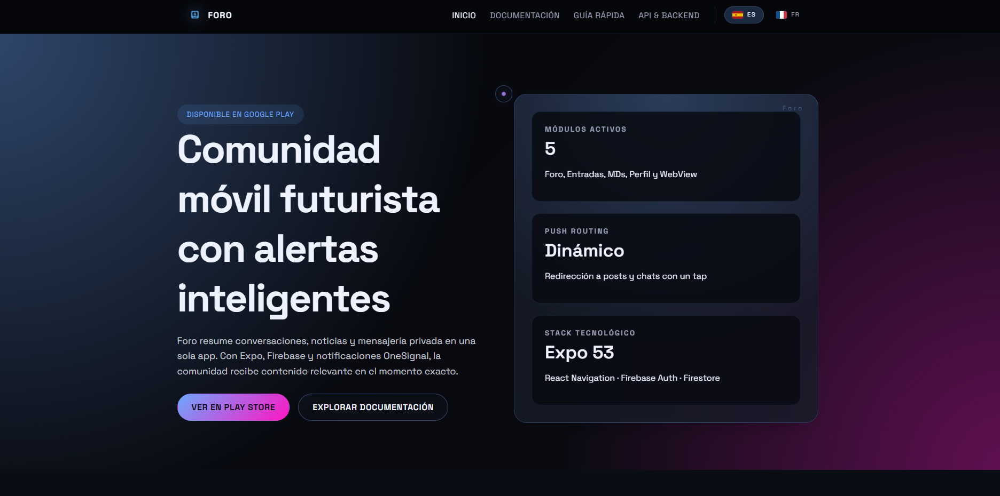

# Foro · Landing & Docs

<p align="center">
  
</p>

Sitio web estático que presenta la app móvil **Foro**: landing principal, documentación profesional bilingüe (es/fr) y estilo futurista con reveal/parallax para acompañar el producto publicado en Google Play.



## Características

- **Landing futurista:** hero con showcase, módulos destacados, hoja de ruta y CTA.
- **Docs bilingües:** guía introductoria, guía rápida y API/backend en español y francés.
- **Estética consistente:** gradientes neón, tipografías Space Grotesk/Chakra Petch, modo oscuro.
- **Interacciones UX:** revelado progresivo, parallax suave y cursor personalizado.
- **Responsive:** diseño adaptado a desktop/tablet/móvil, soporte `prefers-reduced-motion`.

## Estructura principal

```
assets/
  css/styles.css        # estilos globales, reveal, parallax, cursor, brand
  js/main.js            # activación de navegación, reveal, parallax, cursor
  images/               # logo, banderas, mockups
index.html              # landing principal (es)
fr/index.html           # landing en francés
[:docs|fr/docs]/        # documentación es / fr
```

## Ejecutar en local

- **Producción:** https://foro-nu.vercel.app/

1. Clona el repositorio y entra al proyecto.
2. Sirve los archivos con cualquier servidor estático (por ejemplo `npx serve .` o `python -m http.server`).
3. Abre `http://localhost:3000/index.html` (o el puerto que corresponda).

## Personalización

- **Logo / mockups:** reemplaza `assets/images/logo.png` y `assets/images/foro.png`.
- **Colores:** ajusta variables en `:root` dentro de `assets/css/styles.css`.
- **Contenido:** edita `index.html`, `fr/index.html` y los HTML dentro de `docs/` y `fr/docs/`.
- **Bandera / idiomas:** el selector usa SVGs en `assets/images/flag-es.svg` y `flag-fr.svg`. Añade más idiomas duplicando la estructura de páginas.

## Créditos

- Diseño e interacciones implementadas especialmente para la app Foro Redención.
- Construido con HTML + CSS + JavaScript vanilla.
